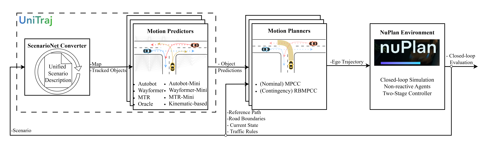

## Holistic Evaluation Motion Prediction &amp; Planning for Autonomous Driving
>A closed-loop simulation & evaluation framework testing different SotA prediction models with different model predictive control planners.
>This is the official repository of  
>**Closing the Loop: Motion Prediction Models beyond Open-Loop Benchmarks** [](https://arxiv.org/pdf/2505.05638)





<table width="100%">
  <tr>
    <td align="center" width="33%">
      <br>
      <strong>MTR + MPCC</strong>
    </td>
    <td align="center" width="33%">
      <br>
      <strong>MTR Mini + ReachBMPCC</strong>
    </td>
    <td align="center" width="33%">
      <br>
      <strong>MTR + BMPCC</strong>
    </td>
  </tr>
  <tr>
    <td align="center" width="33%">
      <br>
      <strong>Wayformer + MPCC</strong>
    </td>
    <td align="center" width="33%">
      <br>
      <strong>Wayformer Mini+ ReachBMPCC</strong>
    </td>
    <td align="center" width="33%">
      <br>
      <strong>Wayformer + BMPCC</strong>
    </td>
  </tr>
  <tr>
    <td align="center" width="33%">
      <br>
      <strong>AutoBot + MPCC</strong>
    </td>
    <td align="center" width="33%">
      <br>
      <strong>AutoBot Mini + ReachBMPCC</strong>
    </td>
    <td align="center" width="33%">
      <br>
      <strong>AutoBot + BMPCC</strong>
    </td>
  </tr>
</table>

## Highlight

- We provide a modular planner that allows testing different predictor-planner pairs in the NuPlan simulation framework
- We integrate control planners for the NuPlan simulation framework:
  - Model Predictive Contouring Control, MPCC (as single-scenario nominal planner)
  - Branching Model Predictive Contouring Control, BMPCC (as scenario-based contingency planner)
  - Reach-based Model Predictive Contouring Control, RBMPCC (as compute-efficient scenario-based contingency planner)

## Getting Started
### Installation
0. Create a new conda environment

```bash
conda create -n pred2plan
conda activate pred2plan
```

1. Install Pred2Plan:

```bash
git clone https://github.com/continental/pred2plan.git
cd pred2plan
pip install -r requirements.txt
pip install -r requirements_nuplan.txt
pip install -r requirements_no_deps.txt --no-deps
```

3. \[**Optional**]\: Follow [Ipopt Installation Instruction](https://coin-or.github.io/Ipopt/INSTALL.html#DOWNLOAD_HSL) for speed-up (factor 2-5x) of the MPC planners.

### Training and Open-Loop Testing Prediction Models

We provide logic for different families of prediction models - those with agent-centric vs query-centric input data and those with marginal vs joint predictions. Currently we include:
- Kinematic constant velocity (agent-centric, marginal)
- Map-based Kinematic constant velocity (query-centric, marginal)
- AutobotEgo (agent-centric, marginal)
- Wayformer (agent-centric, marginal)
- MotionTransformer (agent-centric, marginal)

You can train and evaluate prediction models on different data splits, e.g.:

```
 python predictor/run.py \
    train=True \
    tune=False
    test=True \
    predict=False \
    predictor/model=wayformer \
    predictor/trainer=wayformer \
    predictor/data=marginal_all \
```

Please refer to the [predictors/README](predictor/README.md) for more details!

### Simulation of Prediction-Planner Pairs in NuPlan

You can simulate by different predictor-planner pairs on NuPlan subsets. E.g., for the wayformer-MPCC pair:

```
 python simulation/sim.py \
    simulator=nuplan_nonreactive \
    planner=mpcc \
    predictor/model=wayformer \
    predictor/data=marginal_all \
    predictor.trainer.resume_ckpt_path=>insert_your_checkpoint<
    simulator/scenario_filter=test14_hard
    simulator.scenario_filter.limit_total_scenarios=1
    planner.modular_planner.visualization=True
```

Please refer to the [simulation/README](simulation/README.md) for more details!

## Citation

If you find this repo useful, please consider giving us a star 🌟 and citing our related paper.

```bibtex
@article{bouzidi2025closing,
    title={Closing the Loop: Motion Prediction Models beyond Open-Loop Benchmarks},
    author={Mohamed-Khalil Bouzidi and Christian Schlauch and Nicole Scheuerer and Yue Yao and Nadja Klein and Daniel Göhring and Jörg Reichardt},
    year={2025},
  journal={arXiv preprint arXiv:2505.05638}
}
```


## Acknowledgements

This repo benefits from [UniTraj](https://github.com/vita-epfl/UniTraj), [nuplan-devkit](https://github.com/motional/nuplan-devkit), [pluto](https://github.com/jchengai/pluto). We thank the authors for their great works!
